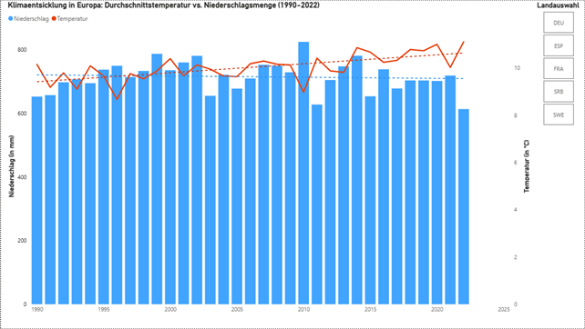

# 🌍 Datenanalyse & Visualisierung historischer Klimadaten (1990-2022)

**End-to-End Data Science Projekt:** Automatisierter API-Abruf, strukturiertes Data Wrangling in R und interaktives Management-Reporting in Power BI.

---

## 🛠️ Eingesetzte Technologien
- **Data Engineering:** R (Tidyverse, jsonlite, dplyr, tidyr)
- **Data Visualization:** Microsoft Power BI, Power Query
- **Datenquelle:** World Bank Climate Knowledge Portal API

## 📋 Kurzübersicht des Projekts

1. **Datenbeschaffung (API):** Automatisierter Abruf historischer Temperatur- und Niederschlagsdaten für fünf europäische Länder.
2. **Datentransformation (R):** Umstrukturierung der rohen JSON-Daten durch Tidy-Data-Prinzipien (`pivot_longer`, `pivot_wider`), Typkorrekturen und Qualitätssicherung.
3. **Datenvisualisierung (Power BI):** Entwicklung eines interaktiven Dashboards zur Identifikation langfristiger Klimatrends (inklusive Korrektur von Lokalisierungskonflikten und physikalischen Aggregationen).

## 📄 Detaillierte Projektdokumentation

Eine ausführliche, chronologische Projektdokumentation (inklusive Lösungsansätzen für Datensilos, Erklärungen zum Code und kritischer Reflexion zur visuellen Wahrnehmung) befindet sich im Projektordner:
👉 **[Zur PDF-Dokumentation](docs/Dokumentation_Projektverlauf.pdf)**

---

## 📈 Finales Dashboard

Das Resultat der Daten-Pipeline zeigt einen klaren, messbaren Aufwärtstrend der europäischen Durchschnittstemperatur bei gleichzeitig konstantem Niederschlagsvolumen:

